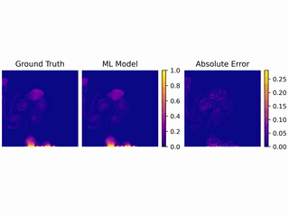

# BubbleML

A multi-physics dataset of boiling processes.

This dataset can be used to train operator networks, act as a ground truth for Physics-Informed Neural Networks, or train computer vision models.
These models have applications to cooling systems for datacenters (I.e., liquid cooling flowing across a GPU) or even cooling nuclear reactors (I.e., a pool of liquid sitting on a heated surface).

This repository provides baselines and sample applications for the bubble ML dataset. Sample videos can be seen in [video/](video/). 

## Dataset Downloads

The dataset is hosted on AWS. Each boiling study can be downloaded separately.

| Study             | Size |
|--------------------------|
| [Single Bubble]()     | GB |
| [PB Saturated]()      | GB |
| [PB Subcooled]()      | GB |
| [PB Gravity]()        | GB |
| [FB Inlet Velocity]() | GB |
| [FB Gravity]()        | GB |
| [3D Simulations]()    | GB |

## Code Installation and Usage

The code currently assumes access to a fairly modern Nvidia GPU, though
it may also work on AMD GPUs if PyTorch is installed with Rocm support.
Results have been reproduced with V100, A30, and A100 GPUs using PyTorch 2.0.

To install dependencies, we recommend creating a conda environment:

~~~~
some conda command
~~~~

We recommend installing [PyTorch](https://pytorch.org/get-started/locally/) manually since
there are more architecture specific options.

## Repository Overview

TODO: probably need to tidy things up more...

